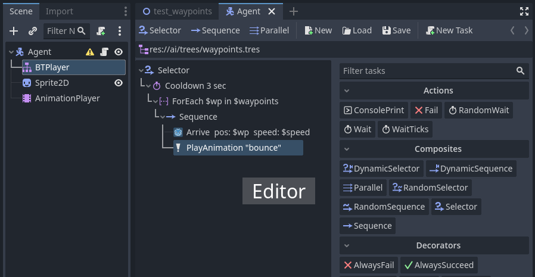
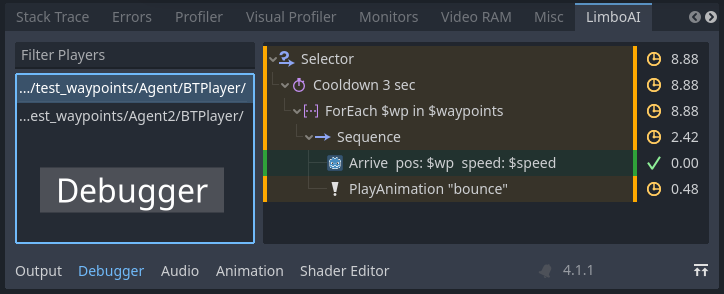

LimboAI - Behavior Trees and Hierarchical State Machines for Godot Engine 4
---
LimboAI is a C++ module for Godot 4 that provides an implementation of Behavior Trees and State Machines, which can be used together to create complex AI behaviors.

>**🛈 Supported Godot Engine: 4.1**

>**🛈 License**: Use of this source code is governed by an MIT-style license that can be found in the LICENSE file or at https://opensource.org/licenses/MIT.

## Features

- Behavior Trees (BT):
    - Use the `BTPlayer` node to execute `BehaviorTree` resources.
    - Easily create, edit, and save `BehaviorTree` resources within the editor.
    - Combine and nest tasks in a hierarchy to create complex behaviors.
    - Control the flow of execution using composite, decorator, and condition tasks.
    - Write your own tasks by extending core classes: `BTAction`, `BTCondition`, `BTDecorator` and `BTComposite`.
    - Built-in class documentation. Check out the `BehaviorTree` and `BTTask` class documentation to get started.
    - Utilize the `Blackboard` for seamless data sharing between tasks.
    - Use the `BTSubtree` task to execute a tree from a different resource file, promoting organization and reusability.
    - Blackboard scopes separate namespaces of variables from subtrees, and enable advanced techniques like sharing data among agents in a group.
    - Visual Debugger: Inspect the execution of any BT in a running scene to identify and troubleshoot issues.
    - Evaluate the performance of your trees with custom performance monitors.
- Hierarchical State Machine (HSM)
    - Extend `LimboState` class to implement state logic.
    - `LimboHSM` node serves as a state machine that manages `LimboState` instances and transitions.
    - `LimboHSM` is a state itself and can be nested within other `LimboHSM` instances.
    - Event-based: Transitions are associated with events, and are triggered by the state machine when the relevant event is dispatched, allowing for better decoupling of transitions from state logic.
    - Combine state machines with behavior trees using `BTState` for advanced reactive AI.
    - Delegation: Instead of extending `LimboState`, utilize vanilla `LimboState` and delegate implementation to provided callback functions. Perfect for game jams and quick prototyping.
    - 🛈 Note: Currently, state machine transition setup and initialization must be done through code as there is no GUI editor for state machines at the moment.

## Compiling

> 🛈 Precompiled builds are a WIP

To incorporate this module, you'll need to build Godot Engine from source with LimboAI module included.

Building From Source:

- Download the Godot Engine source code and put this module source into the `modules/limboai` directory.
- Consult the Godot Engine documentation for instructions on [how to build from source code](https://docs.godotengine.org/en/stable/contributing/development/compiling/index.html).
- If you plan to export a game utilizing the LimboAI module, you'll need to build export templates as well.

## Contributing

All contributions are welcome! Feel free to open issues with bug reports and feature requests, and submit PRs.

## Roadmap

Features and improvements that may be implemented in the future:

- Providing precompiled builds for download.
- Creating a non-trivial demo project to showcase the capabilities of LimboAI.
- Exploring the execution history of Behavior Trees in the Visual Debugger.
- Tests and CI.
- Expanding the library of tasks that can be optionally included in the build.
- Implementing an ignore list for tasks that users may want to hide in the task panel.
- GUI editor for state machines.
- Supporting GDExtension in the future, once it matures.
